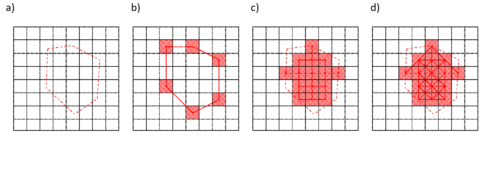

# City.Net Synthesis Template

This software was a part of the City.Net project with Paul Grogan, Sydney Do, Afreen Siddiqi, Olivier de Weck, Anas Alfaris, Adedamola Adepetu, and Davor Svetinovic during February - May 2011 in collaboration between the Massachusetts Institute of Technology and Masdar Institute of Science and Technology. Paul Grogan was supported by a National Defense Science and Engineering Graduate Fellowship (NDSEG) during this period.

- Version 4, 24-March, 2019: Transfered to GitHub repository and updated this document.
- Version 3, 30-May, 2011: Corrected SVN repository URL and completed coordinate reference frames section. Updated node region and edge region types. Added partial quick start tutorial as Appendix B (missing portions of transportation system node and edge definition).
- Version 2, 24-May, 2011: Added graphical examples of node and edge regions, added section on coordinate frames.
- Version 1, 10-May, 2011: Initial Version

## Introduction
The City.Net Synthesis Template was created to help synthesize the various systems to be analyzed within the City.Net decision support tool. The Synthesis Template is an object-oriented MATLAB program which allows system representations to be entered, checked, and visualized.

The focus of Synthesis is simply to represent data across various systems in a common format, which should not require any additional programming. In future development, the Synthesis Template will be extended to Analysis and Evaluation, which both will require custom behaviors to be programmed.

## Synthesis Primer
Before you start synthesizing the city systems, let’s first discuss some of the high-level topics on this model construction. These will include definitions of coordinate reference frames, cells and layers (spatial and functional positioning), and nodes and edges (static and dynamic resources).

### Coordinate Reference Frames
The primary reference frame used for geo-spatial systems is the geographic coordinate frame, which uses a spherical coordinate system of latitude, longitude, and altitude (above sea level) to define points on the surface of the Earth. To better accommodate city features which do not follow the orthogonal cardinal directions (north-south and east-west), the synthesis template allows a rotation from the geographic coordinates to a local city coordinate frame.

On the city scale, coordinates are assumed to be planar Cartesian (i.e. orthogonal). The local city coordinate frame has both an X- and a Y-axis; typically the Y-axis runs more north-south, and the X-axis more east-west. Positive Y- is usually more south, positive X is usually more east. The rotation between the local coordinate frame and the geographic frame is specified in degrees counterclockwise, from the local coordinate frame to the geographic coordinate frame. For an example, see Figure 3 below.

In Figure 1, the local coordinate frame origin is defined at the longitude, latitude pair (θ, φ). The local coordinate frame axes are rotated by approximately 50 degrees (α) counter-clockwise from cardinal directions. The positive X-axis points to the south east and the positive Y-axis points to the south west.

Figure 1: Reference Frames for a Sample City

### Cell and Layer Definition
The spatial area of a city is divided into rectangular cells which determine the level of analysis fidelity. Cells need not be square nor share common boundaries; however this is the most common format. Cells may either be defined in the synthesis template input file, or automatically generated during the synthesis execution. In the former case, each individual cell is specified by its vertices, while in the latter case cells would be specified by a bounding area and meshing rules (e.g. number of rows and columns).

Figure 2: Sample City with 64 Cells

Figure 3: Sample City with 5 Layers

The functional aspects of a city are divided into logical layers which often are illustrated in the z-direction in visualizations. There can be any number of layers within a city to represent several components within the same cell across functional domains. Layers must be specified in the synthesis template input, as they are used within the definitions of nodes and edges (covered in the next section).

### Node Definition

A node is defined by the intersection of a cell (spatial details) with a specific layer (functional details). Each node is provided a type which in turn inherits specific attributes – this formulation allows the user to change attributes in a single location to update all associated nodes.

Although it is the ultimate goal to define the set of nodes within a system, this task is complicated by the definition of cells. To allow a transition between multiple levels of analysis fidelity, nodes are preferable defined through the use of node regions. A node region is an area where nodes are generated at any cells that meet the generation conditions. A node region is only specified at a single layer, and as one associated node type for assignment to the generated nodes.

There are three available types of node regions: polygon, polyline, and polypoint. A polygon node region generates nodes at cells that have sufficient overlap with a polygon region. A polyline node region generates nodes at cells that intersect a multi-segment line. Finally, a polypoint node region generates nodes at cells that contain vertices. Examples of the three types of node regions are shown below in Figure 4.

Figure 4: a) Node Region Vertices with Type b) Polygon c) Polyline d) Polypoint

For example, consider the figure below. A potential node region is drawn as a polygon overlaying a default cell grid. During the node generation process, nodes will be generated at any cell having a critical fraction of overlap with the node region. Examples of 0.0, 0.5, and 1.0 for a minimum overlap fraction are shown below  in Figure 5.

Figure 5: a) Node Region with Minimum Overlap Fraction b) 0.0, c) 0.5, and d) 1.0

### Edge Definition

An edge is defined by a connection between two nodes (each positioned at a cell and within a layer). Edges will always connect nodes within the same system, but may span two different layers. Just like in the case of the nodes, each edge is provided a type which in turn inherits specific attributes – this formulation allows the user to change attributes in a single location to update all associated edges.

Again, although it is the ultimate goal of synthesis to define the set of edges within a system, this task is complicated by the definition of cells. Similar to node regions, edge regions can be defined to specify regions where edges should be generated. There are two types of edge regions in use: linear and spatial. Linear edge regions (polyline and polypoint) specify segments between locations where an edge should exist. Spatial edge regions (polygon orthogonal, adjacent, and connected) specify regions where all nodes should be considered for connection under a generation rule.

For example, consider Figure 6 below. A potential edge region is drawn as a polygon overlaying a default cell grid. During the edge generation process, edges will be generated between existing nodes according to the edge region connectivity option. The polyline perimeter option generates edges between adjacent vertices of the polygon. The orthogonal and all neighbors options generate edges in orthogonal and diagonal directions between any nodes inside the region (according to the minimum overlap fraction, covered previously in the node region section). Although not shown, the fully connected option would create edges between each two nodes contained within the region.

Figure 6: a) Edge Region with b) Polypoint, c) Polygon Orthogonal, and d) Polygon Adjacent

## Spreadsheet Templakte

To help the system synthesis process, a spreadsheet template is available for use. This guide will walk through the example transportation system which is available in the `_example` directory.

_Note: On non-Windows operating systems, MATLAB sometimes has difficulty reading Excel spreadsheets. Although the ‘basic’ mode is used for the xlsread functions, sometimes it may still fail due to formatting changes between versions of Excel. If you encounter this issue, save the spreadsheet as an Excel 95 file format._

To be transferred from the original document.

## Appendix A: Object Class Diagram

To be transferred from the original document.

## Appendix B: Quick Start Tutorial

To be transferred from the original document.
